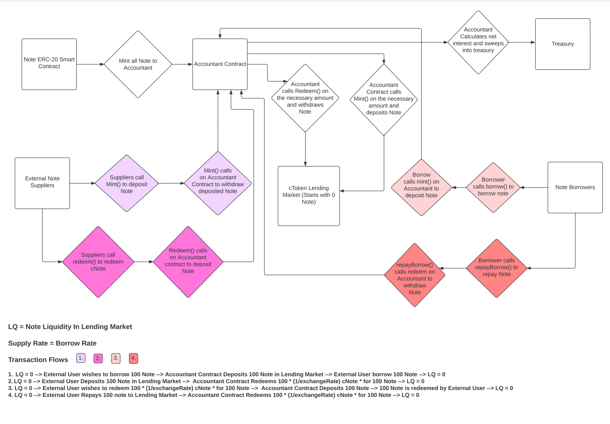

# New Blockchain contest details
- $45,000 USDC + $45,000 protocol tokens main award pot
- $2,500 USDC + $2,500 protocol tokens gas optimization award pot
- Join [C4 Discord](https://discord.gg/code4rena) to register
- Submit findings [using the C4 form](https://code4rena.com/contests/2022-06-new-blockchain-contest/submit)
- [Read our guidelines for more details](https://docs.code4rena.com/roles/wardens)
- Starts June 14, 2022 20:00 UTC
- Ends June 21, 2022 19:59 UTC
- ⚡Ethereum and ⚛Cosmos Leagues

# New Blockchain (Manifest)
### A new EVM enabled Cosmos SDK layer 1

# Table of Contents
1. [Contest Scope](https://github.com/code-423n4/2022-06-newblockchain/blob/main/README.md#contest-scope)
2. [Project Overview](https://github.com/code-423n4/2022-06-newblockchain/blob/main/README.md#project-overview)
3. [Cosmos SDK Blockchain](https://github.com/code-423n4/2022-06-newblockchain/blob/main/README.md#cosmos-sdk-blockchain)
4. [Smart Contracts](https://github.com/code-423n4/2022-06-newblockchain/blob/main/README.md#smart-contracts)
5. [Areas of Specific Concern](https://github.com/code-423n4/2022-06-newblockchain/blob/main/README.md#areas-of-specific-concern)

| Glossary |  |
| --- | --- |
| Manifest/wrapped-Manifest | Native token of New Blockchain, equivalent to Ethereum on the EVM  |
| Note(Stablecoin)  | ERC-20 based Stablecoin soft-pegged to USD by auto-updating interest rate  |
| cNote | Lending market for Note based on compounds cToken market  |
| noteInterestRateModel | Interest rate model used for Stablecoin market with Supply Rate equal to the Borrow Rate and interest rate updated based on the price difference between note and USD |
| Accountant  | Smart contract which owns all Note in existence and is responsible for lending and redeeming Note from cNote lending market when external users require liquidity |
| Treasury  | Smart contract which holds funds from the Community pool as well as interest earned from Accountant supplying Note  |
| UniGov(Unified Governance)  | Cosmos SDK module which updates Proposal Map Contract when governance proposals for dApps pass on Cosmos Governance Module  |
| Dripper/Reservoir | Mechanism to meter rewards for suppliers and borrowers of the Lending Market  |
| Proposal Map Contract  | Storage contract with function to query proposal data by ID  |
| ZeroSwap | Zero fee Dex without governance forked from Sushiswap/Solidly  |
| cToken  | Lending Market for tokens forked from Compound  |
| LP (token) | Token that represent share in Liquidity Pool |
| Lending Market  | Compound fork without Compound Token and modified governance, |

# Contest Scope

This contest includes code for 3 separate solidity DApps as well as one Cosmos SDK blockchain. The 3 DApps are Zeroswap, Stableswap and Lending Market which are forks of Sushiswap, Solidly and Compound respectively. The blockchain is Manifest, which is an Evmos fork. 

## Project overview

New Blockchain(Manifest) is a Layer 1 blockchain built using Cosmos SDK core modules and Tendermint Consensus with an EVM execution layer in the form of the Ethermint Module and network owned/incentivized defi primitives(stablecoin, dex, lending market). 

The aim of New Blockchain is to become the best execution layer for **original** work. New Blockchain accomplishes this by offering: 

- **Free Liquidity:** Zero LP Fees. New Blockchain makes liquidity free for protocols, arbitrageurs and traders.
- **Rent Extraction Resistant:** New Blockchain aims to establish Credibly Neutral Public Infrastructure. Core defi primitives will not have sovereign governance tokens and will have no capacity to extract rent in the future.

New Blockchain’s core blockchain infrastructure is forked from EVMOS ([https://docs.evmos.org/](https://docs.evmos.org/)), including the main Ethermint and ERC-20 modules which simulate a EVM execution environment (Ethermint module) and offer native conversion between Cosmos SDK coins and ERC-20 tokens using an internal bridging mechanism (ERC-20 module). The claims module and incentives module are removed and we have added a custom Unified Governance Module that allows specific types of proposals that pass in the Governance module to be pushed to a storage contract on the EVM and read by dApps deployed on the EVM. 

New Blockchain provides free liquidity to the ecosystem by removing swap fees from its native dex Zeroswap, a fork of SushiSwap without governance or a protocol token. Liquidity providers who supply their LP tokens to the lending market receive rewards in the form of wrapped-Manifest tokens. 

The native lending market on New Blockchain is a fork of Compounds most recent codebase with the removal of Compounds native governance token Comp. Governance instead is conducted by submitting and voting on proposals through the Governance Module in the Cosmos SDK. When proposals pass, the storage smart contract on the EVM is updated with the proposal that passed. The proposal that was added can then be queued into the timelock for execution. **Instead of dripping Comp token rewards to suppliers and borrowers, we are dripping the wrapped version of New Blockchains native token which is identical to wrapped-ETH. This involves wrapping New Blockchain token sent from the Treasury using the WETH-9 smart contract and then sending these tokens to the Reservoir of Compound.** 

The stable coin of the ecosystem Note is implemented as a standard ERC-20 token smart contract which has it’s full supply minted to another smart contract Accountant.sol. The only way to create new Note is to borrow it directly from the cNote lending market in the same way any other asset is borrowed. The noteInterestRateModel is a new model that has Supply Rate and Borrow Rate set to the same value. 

Since Note cannot be created, only borrowed, and the Supply Rate is the same as the Borrow Rate we needed to create a mechanism to keep track of how much of the interest paid by the market to borrow Note goes to the Accountant and eventually gets swept into the Treasury vs how much is paid to external suppliers. This is done by supplying and redeeming liquidity during every action taken by an external user of cNote. When users borrow Note or redeem cNote, the function in CNote will call another function in the Accountant to supply cNote in the exact amount required to offset the request. When Users supply or repay Note to the market, the function in CNote will call another function in Accountant to redeem exactly the same amount of Note from the market. This results in there never being any Note present in the CNote market other than during function calls, while also providing an infinite amount of Note to be borrowed or redeemed from the Market.

---

# Cosmos SDK Blockchain

## Unigov Module (sloc 615)

The unigov module is a wrapper around the Cosmos-sdk x/gov module. The module defines two proposal types (as well as their JSON formats): LendingMarketProposals, TreasuryProposals. The proposals are structured after the Compound-Finance Protocol’s proposal type, that is, each proposal is essentially an array of tuples: (signature, calldata, msg.value). Upon a proposal’s passing, the proposalHandler either deploys the ProposalStore contract (if it is not already deployed) or appends the proposal into the ProposalStore’s mapping ( uint ⇒ Proposal). The Unigov module uses the [evm.Call](http://evm.Call)() method from geth to route/create messages within the EVM. 

### unigov/keeper
- Defines the cosmos-sdk keeper object/interfaces, so that external modules may interact with unigov.

### unigov/types
- Defines the base types within unigov as well as the proto-buf generated data-structures/encoding methods.

### unigov/proposalHandler.go
- Defines the govtypes.Handler method required for catching Passed proposals and appending them to the ProposalStore contract.
---
# Smart Contracts

## Unified Governance:

Unified Governance refers to the Governance Bridge between the Cosmos SDK Governance Module and the storage contract in the EVM that is owned by the Governance Module and that receives updates when designated proposals are passed. There is only one smart contract that is used, the storage contract that receives updates: 

#### proposalStore.sol (60 sloc):

- stores all the proposals that are designated for the lending market and have passed in the Governance Module of the Cosmos SDK
- Can be queried by other smart contracts by passing in a proposalID to the queryProp function

## Zeroswap/Stableswap (Sushiswap/Solidly Forks):

Zeroswap and Stableswap are sushiswap and solidly forks respectively with all fee related logic removed. No other changes were made. An externally updated TWAP oracle was added to Zeroswap in uniswap/UniswapV2Oracle.sol

#### [BaseV1Pair](https://github.com/Plex-Engineer/stableswap/blob/489d010eb99a0885139b2d5ed5a2d826838cc5f9/contracts/BaseV1-core.sol#:~:text=contract%20BaseV1Pair%20%7B) (368 sloc):

- the pair contract containing all core logic for providing liquidity for and swapping 2 token pairs

#### [BaseV1Factory](https://github.com/Plex-Engineer/stableswap/blob/489d010eb99a0885139b2d5ed5a2d826838cc5f9/contracts/BaseV1-core.sol#:~:text=contract%20BaseV1Factory%20%7B) (51 sloc): 

- the factory contract containing methods to manage and create new pairs

#### [BaseV1Router](https://github.com/Plex-Engineer/stableswap/blob/489d010eb99a0885139b2d5ed5a2d826838cc5f9/contracts/BaseV1-periphery.sol#:~:text=contract%20BaseV1Router01%20%7B) (376 sloc):

- the router contract which directs calls to the correct pair contract

## Lending Market (Compound Fork):

The Lending Market is a decentralized money market forked from Compound protocol. The lending protocol utilizes the full suite of Compound Smart Contracts. The full compound documentation can be found [here](https://github.com/compound-finance/compound-protocol). The modifications that we have made include the removal of proposing and voting from the GovernorBravo logic as well as the modification of Comptroller to allow for the granting of any generic ERC-20 token as a reward instead of Comp token : 

### Compound.sol (removed):

- We removed the governance token as well as any functionality related to voting or proposing in Compound

#### [WETH](https://github.com/Plex-Engineer/lending-market/blob/755424c1f9ab3f9f0408443e6606f94e4f08a990/contracts/WETH.sol#:~:text=contract%20WETH%20is%20EIP20Interface%20%7B) (80 sloc):

- Standard Wrapped Ether contract used to wrap Manifest token in an ERC-20 format
- Allows the Reservoir.sol contract to drip Wrapped version of Manifest token as a reward for supplying tokens to Lending Market

#### [GovernorBravoDelegate](https://github.com/Plex-Engineer/lending-market/blob/755424c1f9ab3f9f0408443e6606f94e4f08a990/contracts/Governance/GovernorBravoDelegate.sol#:~:text=contract%20GovernorBravoDelegate%20is%20GovernorBravoDelegateStorageV2%2C%20GovernorBravoEvents%20%7B) (148 sloc):

- Responsible for the core governance logic including retrieving proposal data and queueing proposals in the timelock
- Original implementation allowed for the creation of proposals and also had logic related to voting. This logic has been removed
- We have implemented an interface for our Unified Governance Smart Contract

#### [Comptroller](https://github.com/Plex-Engineer/lending-market/blob/755424c1f9ab3f9f0408443e6606f94e4f08a990/contracts/Comptroller.sol#:~:text=contract%20Comptroller%20is%20ComptrollerV7Storage%2C%20ComptrollerInterface%2C%20ComptrollerErrorReporter%2C%20ExponentialNoError%20%7B) (735 sloc): 

- Responsible for the core business logic of the lending market
- Identical to Compound except for a modification to the grantCompInternal() function which removes the reference to Comp() and replaces it with a reference to a generic EIP-20 Interface

## Stablecoin:

- Note is a USDC/USDT soft-pegged stablecoin that is backed by collateral lent to the native lending protocol on New Blockchain. Note is over-collateralized so for every note that is in circulation there is more than 1 USD worth of collateral held in cToken collateral by Lending Market
- Note has an algorithmically pegged value to USD in the sense that it’s interest rate is derived from the price differential between itself and a designated proxy for USD such as USDC
- The interest rate is pegged to the price difference by this relationship:
    - Interest Rate = max(0,(1 - price of Note on Dex)*Adjuster Coefficient+ priorInterestRate)
- Both the Supply and Borrow rates are the same
- All Note in existence is minted to the Accountant smart contract on deployment
- Due to the fact that Note has the same Borrow and Supply Rates and the fact that all Note in existence is created on deployment and owned by the Accountant.sol smart contract, in order to avoid inflating the supply we must ensure that we are effectively accounting for the amount of interest the Accountant earns versus the amount of interest borrowers are paying:
    - If we allow Note to sit idle in the lending market pool and the interest rate is not 0% then Accountant will be earning interest on Note it has not lent out which will inflate the supply
    - If we do not remove the Note that is repaid by Borrowers then there will be Note in the lending market that is earning interest but not borrowed by anyone
- Implementing this into NBLM’s current architecture without causing inflation requires that:
    - Note always be available to borrow or redeem
    - Note never sit idle in the lending market pool
- We achieve this by implementing an additional call in the mintFresh/redeemFresh, borrowFresh/repayBorrowFresh internal methods in CToken.sol that has Accountant.sol deposit or remove liquidity from the lending market in the exact amount that the user requires. This results in 0 liquidity in the lending pool at any given time but infinite liquidity available to borrow from the Accountant.
- **IMPORTANT: The internal price in the lending market used to calculate liquidity for Note is always set to 1 USD regardless of the value of Note in the Dex.**
- Our implementation of this architecture is described below

## Accountant

On genesis, type(uint).max Note is minted to the Accountant, on borrows/redeems into the cNote Lending Market, the Accountant supplies Note to the cNote contract, receiving cNote in return. On repayBorrows and mints, the Accountant redeems suppliedNote/curExRate cNOTE, and receives the Note it had previously lent to the market. The interest earned on the Note the Accountant lends to the market is swept to the treasury via an external method in Accountant.

#### [AccountantDelegator](https://github.com/Plex-Engineer/lending-market/blob/755424c1f9ab3f9f0408443e6606f94e4f08a990/contracts/Accountant/AccountantDelegator.sol#:~:text=contract%20AccountantDelegator%20is%20AccountantInterface%2C%20AccountantDelegatorInterface%20%7B) (138 sloc) 
- Handles and delegates calls to the current implementation of AccountantDelegate.

#### [AccountantDelegate](https://github.com/Plex-Engineer/lending-market/blob/755424c1f9ab3f9f0408443e6606f94e4f08a990/contracts/Accountant/AccountantDelegate.sol#:~:text=contract%20AccountantDelegate%20is%20AccountantInterface%2C%20ExponentialNoError%2C%20TokenErrorReporter%2C%20ComptrollerErrorReporter%7B) (95 sloc)
- handles the core logic of supplying/redeeming Note/cNote in the cNote lending market.

#### [AccountantInterfaces](https://github.com/Plex-Engineer/lending-market/blob/755424c1f9ab3f9f0408443e6606f94e4f08a990/contracts/Accountant/AccountantInterfaces.sol#:~:text=contract%20AccountantDelegatorStorage%20%7B) (34 sloc)
- Interfaces that AccountantDelegat(e/or) implement. Any future proposed implementation of AccountantDelegate should extend the base AccountantDelegate contract, and should define added functionality as an interface in this file.

## Treasury

The treasury receives the interest swept from the Accountant. In maintains a reserve of Note for community use. These funds are dispersed via UniGov Proposals.

#### [TreasuryDelegator](https://github.com/Plex-Engineer/lending-market/blob/755424c1f9ab3f9f0408443e6606f94e4f08a990/contracts/Treasury/TreasuryDelegator.sol#:~:text=contract%20TreasuryDelegator%20is%20TreasuryDelegatorInterface%2C%20TreasuryInterface%7B) (131 sloc)
- Handles and delegates calls to the current implementation of the Treasury.

#### [TreasuryDelegate](https://github.com/Plex-Engineer/lending-market/blob/755424c1f9ab3f9f0408443e6606f94e4f08a990/contracts/Treasury/TreasuryDelegate.sol#:~:text=contract%20TreasuryDelegate%20is%20TreasuryInterface%20%7B)
- Handles core logic of receiving funds from the Accountant, and sending funds via proposal request.

#### [TreasuryInterfaces](https://github.com/Plex-Engineer/lending-market/blob/755424c1f9ab3f9f0408443e6606f94e4f08a990/contracts/Treasury/TreasuryInterfaces.sol#:~:text=contract%20TreasuryDelegatorStorage%20%7B) (27 sloc)
- Interfaces that both TreasuryDelegat(e/or) implement. Any future implementations of TreasuryDelegate must extend the TreasuryDelegate contract, and should define added functionality as an interface in this file.

#### [CNote](https://github.com/Plex-Engineer/lending-market/blob/755424c1f9ab3f9f0408443e6606f94e4f08a990/contracts/CNote.sol#:~:text=contract%20CNote%20is%20CErc20Delegate%20%7B) 
- CNote extends the CErc20Delegate base contract. It is the Lending Market for Note.
- The mintFresh/redeemFresh, borrowFresh/repayBorrowFresh internal methods in CToken.sol are overridden here to implement the calls for Accountant to mint() or redeem() Note from the lending market when external users remove or deposit Note into the lending market as described above.

#### [noteInterest.sol](https://github.com/Plex-Engineer/lending-market/blob/755424c1f9ab3f9f0408443e6606f94e4f08a990/contracts/NoteInterest.sol#:~:text=contract%20NoteRateModel%20is%20InterestRateModel%20%7B) (61 sloc):
- Custom interest rate model which sets the Borrow Rate equal to the Supply Rate
- Interest rate is based on the difference between a USD proxy such as USDC and Note as defined by a price oracle connected to our stableswap
- Interest rate is defined as:
    - Interest Rate = max(0,(1 - price of Note on Dex)*Adjuster Coefficient+ priorInterestRate)

---
# Areas of Specific Concern:
- Possible risk of re-entrant attacks in CNote.sol (overridden modifier non-re-entrant)
- Ensure that there is never any Note in the lending Market after a transaction completes
    - We cannot allow the lending Market to have any leftover Note after a transaction occurs otherwise our accounting of interest will be incorrect
- Issues with Note interest rate due to Borrow Rate equaling Supply Rate
- Pricing Oracle for Stableswap and Swap being TWAP oracles and having no offchain oracle to rely on
    - This is a big concern of ours given that the TWAP price is always lagging the true price but the shorter the TWAP the more susceptible to manipulation the price of the underlying asset is
    - Ensure that liquidations can occur effectively and that Note does not become undercollateralized
- Unigov module works for every possible scenario and is unable to execute a proposal multiple times
    - Ensure that unigov is able to pass any arbitrary proposal for Compound Governance
    - Ensure that these proposals cannot be queued again after they are executed
- Dripping of Wrapped-Manifest token instead of Comp token works effectively
    - Ensure that reservoir can receive Wrapped-Manifest token that is wrapped using the WETH-9 contract
    - Ensure that reservoir can properly drip Wrapped-Manifest token to the correct lending markets at the specified Drip Rate
- Ensure that sweep interest only ever sweeps the amount of interest accrued
    - We absolutely cannot sweep more interest than the Accountant accrued over the time period after the previous sweep
    - If we sweep more than we will be inflating the money supply and undercollateralizing Note
